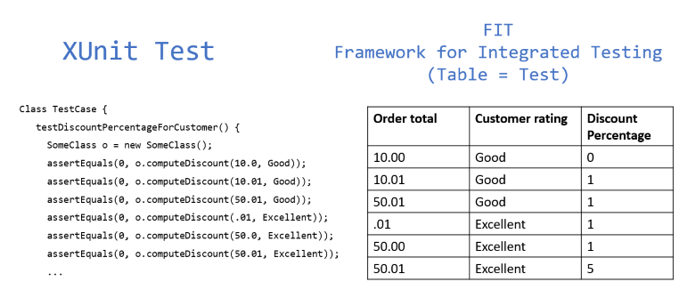

# ATDD - Acceptance Test Driven Development

ATDD isn't a testing technique, it's a software development methodology in which automated acceptance tests are used to drive the development of an application. 

Unlike TDD, which is generally thought of as an engineering practice, ATDD is a team effort: it brings different players in the software development process—testers, engineers, business stakeholders—together to collaborate. The result of said collaboration are the requirements for the application, expressed in a format understandable by everyone, which are then turned into automated acceptance tests.
These acceptance tests represent the user's point of view and act as a form of requirements (acceptance criteria) to describe how the system will function, as well as serve as a way of verifying that the system functions as intended.
> Unit testing solves the problem of “are we building the thing right?”  
> ADTT solves the problem of "are we building the right thing?"

## What are acceptance criteria?

A set of requirements that must be met, also refered to as the "Definition of Done" 

### Traits of effective acceptance criteria:
+ Clear and concise
+ Testable
+ Everyone must understand
+ Provide user perspective

## Acceptance Tests

Normally Acceptance Testing is the last phase of software testing performed after System Testing and before making the system available for actual use. 
Tests can be internal or external:

+ **Alpha Testing**  
Internal and performed by the Testers at Developer's site 
+ **Beta Testing**  
External and performed by people who are not part of the development team at the customer's site, by “real users” of the software application in “real environment” 

### Types of Acceptance Tests

+ **User Acceptance Testing (UAT)**  
User acceptability - only functional
+ **Business Acceptance Testing (BAT)**  
Business goals and purposes
+ **Contract Acceptance Testing**  
Service Level Agreement (SLA) - payment will be made only if the Product services are in-line with all the requirements
+ **Regulations Acceptance Testing (RAT)**  
Rules and regulations defined by the government of a country
+ **Operational Acceptance Testing (OAT)**  
Stability, recovery, compatibility, maintainability, technical support availability, reliability, fail-over, localization

## How is ATDD done?

[Bild 1]: ATDD_Cycle1.png  "ATDD Cyle"
![ATDD Cycle][Bild 1]

#### 1. Discuss  
The customer's requirement is discussed or in other words, the end product that the customer needs from the development is analyzed in detail.

A **user story** is an informal, general explanation of a software feature written from the perspective of the enduser.

**Three amigos** refers to the primary perspectives :
+ Development: How might we build a solution to solve that problem?
+ Business: What problem are we trying to solve?
+ Testing: What about this, what could possibly happen

The output of this phase are acceptance tests in the form of plain English phrases or tables that can be understood by everyone in the organization.

#### 2. Distill

In this stage developers and testes implement the acceptance tests in an automatic testing framework to ensure that they not just remain specifications but can be actually executed in the project. Tests written in a programming language are hard to understand for non-technical members of the team, therefor there are various tools to make tests out of tables and display the results in a form everyone is able to understand.

+ Code written in a specific language
+ Tables explaining all the specifications
+ A guide or wiki explaining the requirements in a specific format

Frameworks for ATDD:

#### 3. Develop - Develop the necessary features
This is the implementation stage where you develop the necessary features. This is done through the test first development approach.
In addition to the regular Unit Tests the acceptance tests make sure that the development is in line with the requirements. ATDD isn't meant to be a replacement for TDD, it is an extension.

#### 4. Demo - give a demo of features to the business stakeholders
Having a discussion with the stakeholders after each cycle is a common feature of the agile development methodology. In these, the team discusses the various features of the product and work on improvements.

## Benefits of ATDD
+ Tighter cross functional team integration
+ Visible story completion criteria
+ Getting Business Rules right
+ Fast Feedback is better than slow feedback
+ Rework down from 60% to 20%
