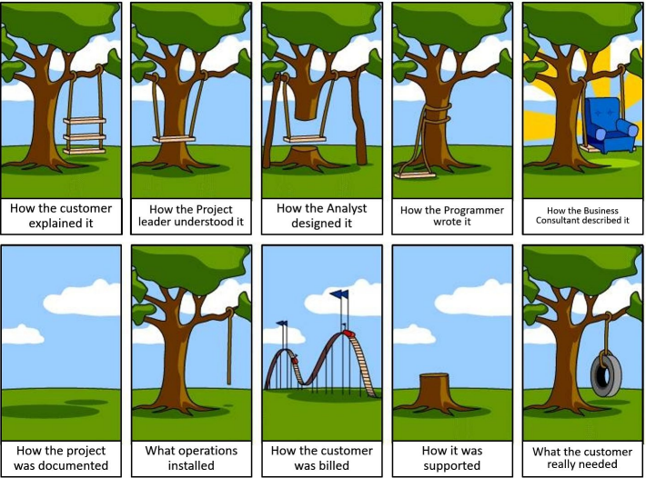
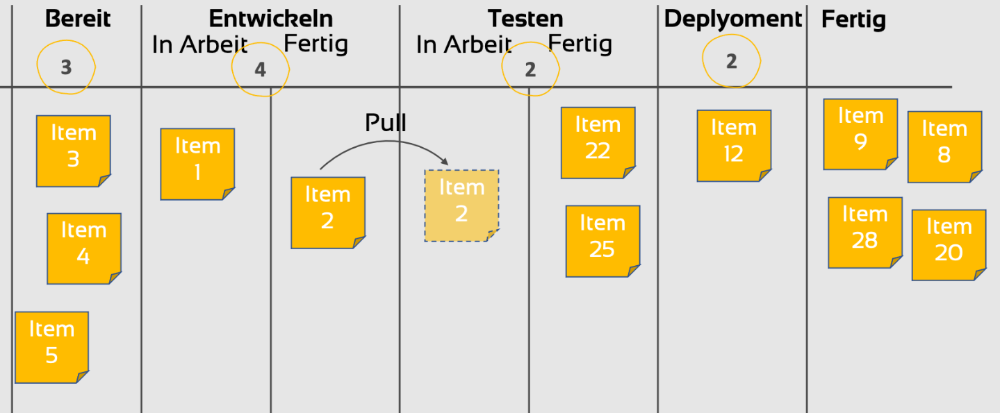
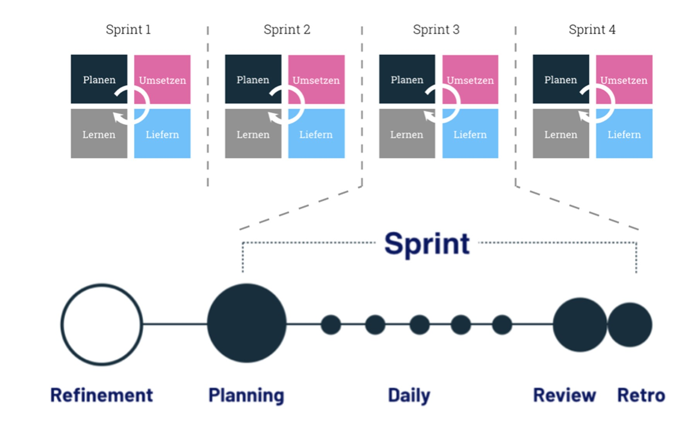
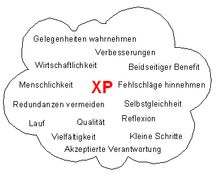
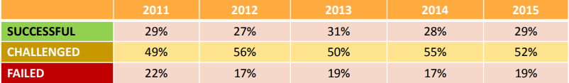

# Agile Methoden
## XP, Kanban and Scrum   

<section>
    <h2>Übersicht</h2>
    
- [Was sind agile Methoden](#sec1)

- [Was ist Kanban](#sec3)
  
- [Was ist Scrum](#sec2)

- [Was ist XP](#sec4)

</section>

    
<section name="sec1">
    <h2>Definition agile Methoden </h2>
    
  - Schnelleres und effizienteres Arbeiten in kleinen Teams

  - Stetige Absprache -> reibungsloser Prozess

  - Einbindung Kundenfeedback
</section >

<section>
    <h2>Vorteile agile Methoden</h2>

  - hohe Flexibilität bei Prozessen

  - Schrittweise Entwicklung der Software 

  - Fehlerer schneller beheben
    
</section>

<section>
    <h2>Geschichte</h2>
    
  - 1990 Krise in der Softwareentwicklung
 
  - Projekte dauerten zu lange  
 
  - Ständige Änderung der Gegebenheiten und Prozesse 
 
  - Projekte abgeändert oder aufgegeben
</section>

<section>
    <h2>Werte agiles Manifest</h2>
        
  - Individuen und Interaktionen wichtiger als Prozesse und Werkzeuge
      
  - Funktionsfähige Produkte wichtiger als umfassende Dokumentation
  
  - Zusammenarbeit mit dem Kunden wichtiger als	Vertragsverhandlung
  
  - Reagieren auf Veränderung wichtiger als	das Befolgen eines Plans
</section>

<section>
    <h2>Prinzipien agiles Manifest</h2>
       
1.	Kunden durch frühe und kontinuierliche Auslieferung wertvoller Software zufrieden stellen

2.	Änderungen in Prozessen sind selbst spät in der Entwicklung willkommen 

3.	Die Lieferung funktionierender Software sollte regelmäßig innerhalb weniger Wochen oder Monate erfolgen

4.	Fachexperten und Entwickler müssen während des Projektes täglich im Unternehmen zusammenarbeiten

5.	Die Arbeit sollte rund um motivierte Individuen organisiert sein 

6.	Informationen werden am effektivsten durch persönliche Gespräche vermittelt
</section>
    
<section name="sec3">
    <h2>Kanban</h2>
           
  - Anerkanntes Vorgehensmodel
   
  - Keine Aufgezwungenen Strukturen

  - Kann sehr leicht integriert werden
</section>

<section>
    <h2>Geschichte</h2>
        
  - Taiichi Ohno
  
      - 1947 Toyota-Produktsystem
  
      - Einführung Pull-Hol Prinzip

  - David J Anderson
  
    - CEO School of Management
  
    - IBM, Sprint, Motorola, Microsoft
  
    - Autor
</section>

<section>
    <h2>Prinzipien agiles Manifest</h2>
  
  - Jap. Kan bedeutet Karte

  - Jap. Ban bedeutet Tafel

  - Agiler Ansatz Prozesse zu optimieren
      
  - Verbesserung durch kleine Schritte

  - Weniger Widerstand durch Grundprinzipien
</section>

<section>
    <h2>Grundprinzipien</h2>
           
  - Abschluss bestehender Prozesse
  
  - Schrittweise Veränderung verfolgen 
  
  - Respektiert bestehende Prozesse bzw. Rollen
  
  - Alle Ebenen sollen sich beteiligen      
</section>

<section>
    <h2>Übersicht Praktiken</h2>

  - Visualisierung
  
  - Limitierung
  
  - Arbeitsfluss
  
  - Explizite Regeln
  
  - Feedbackzyklen
  
  - Verbesserungen durch Modelle
</section>

<section>
    <h2>Visualisierung</h2>

  - Task-Board erstellen
  
  - Arbeitsfluss visualisieren
  
  - Karten mit Aufgaben
  
  - Klare Einsicht der Aufgabenverteilung 
  
  - Fehler schnell erkennbar
</section>

<section>
    <h2>Limitierung</h2>
           
  - Anzahl pro Karten für Bereich begrenzen

  - Pull-Prinzip bei freiem Kartenplatz

  - Optimale Beschränkung (WIP) durch Erfahrung 
</section>

<section>
    <h2>Arbeitsfluss messen</h2>

  - Laufzeit der Aufgaben

  - Auslastung der Bereiche

  - Entwicklung der Karten

  - Fehlerrate

  - Arten von Trackings 
   
</section>

<section>
    <h2>Explizite Regeln</h2>

  - Definition von Begriffen

  - Bedeutung der einzelnen Spalten

  - Zeiten für Meetings 

  - Aufgabenverteilung       
</section>

<section>
    <h2>Feedbackzyklen</h2>
           
  - Stand-up Meetings
  
  - Retrospektiven
  
  - Operation-Reviews
  
  - Release-Meetings
</section>

<section>
    <h2>Modelle</h2>

- Wertstrom
  
- Engpasstheorie
  
- Verbesserung der Prozesse
</section>

<section> 
   
</section>

<section>
    <h2>Vorteile</h2>

- Hohe Transparenz über Fortschritt

- Kurze Durchlaufzeiten

- Unzählige Einsatzgebiete
           
- Wenig Widerstand     
</section>

<section name="sec2">
    <h2>Scrum</h2>
           
- Jeff Sutherland 

- Ken Schwaber 

- 1995 erstmals vorgestellt

- Ständige Weiterentwicklung      
</section>

<section>
    <h2>Prinzipien Scrum</h2>

- Vision
  
- Wertorientierung

- Transparenz
  
- Fokussierung
  
- Autonomie
  
- Prozesstreue
</section>

<section>
    <h2>Definition</h2>
           
- Projektmanagement Methode
  
- Basis agiles Manifest
  
- Vereinfachung der Prozesse
  
- Feste Rollen 
  
- Geplante Events      
</section>

<section>
    <h2>Rollen</h2>
           
- Scrum Product Owner
  
- Scrum Master 
  
- Scrum Team     
</section>

<section>
    <h2>Events</h2>

- Sprint
 
- Sprint-Planung
  
- Daily-Scrum
  
- Sprint-Review
  
- Sprint-Retrospektive
</section>

<section>

</section>

<section name="sec4">
    <h2>XP Geschichte</h2>

- Kent Beck
  
- Ron Jeffries
  
- Martin Fowler
  
- 1997 C3 Projekt Daimler Chrysler
</section>

<section>

*“XP is a lightweight methodology for small to medium sized teams developing software in the face of vague or rapidly changing requirements.”*

Kent Beck
</section>

<section>
    <h2>Was ist XP?</h2>

- Agile Methode
 
- Kleinere bis mittelgroße Projekte
  
- Angaben des Kunden vage
  
- Änderungen jederzeit möglich
</section>

<section>
    <h2>Werte</h2>

- Kommunikation

- Einfachheit

- Rückmeldung

- Mut
  
- Respekt      
</section>

<section>
    <h2>Prinzipien</h2>

</section>

<section>
    <h2>Praktiken</h2>

- The Planning 
  
- Small releases
  
- Metaphore
  
- Simple Design
  
- Testing
  
- Refactoring
</section>

<section>
    <h2>Events</h2>

- Sprint
 
- Sprint-Planung
  
- Daily-Scrum
  
- Sprint-Review
  
- Sprint-Retrospektive
         
- Pair programming
  
- Collective ownership
  
- Continuous integration
  
- 40 hour week
  
- On-site customer
  
- Coding standards
</section>

<section>
    <h2>Team</h2>

- Produkt Owner

- Kunde

- Entwickler
  
- Projektleiter
</section>

<section>
    <h2>Events</h2>

- Sprint
 
- Sprint-Planung
  
- Daily-Scrum
  
- Sprint-Review
  
- Sprint-Retrospektive
</section>

<section>
    <h2>Planung</h2>

- Ganze Team
  
- Kurze Release-Zeiten
  
- User Stories
  
- Aufwandsabschätzung
</section>

<section>
    <h2>Entwicklung und Abschluss</h2>

- Stand-up Meetings
  
- Paar Bildung für Pair-Programming
  
- Stetige Kommunikation
  
- Feedback 
</section>
 
<section>
    <h2>Zusammenfassung</h2>

- Verbesserung der Qualität
  
- Jederzeit Änderungen möglich
  
- Risiko wird verringert
  
- Produktivität erhöht
  
- Spaß wird gefördert
</section>

<section>

</section>